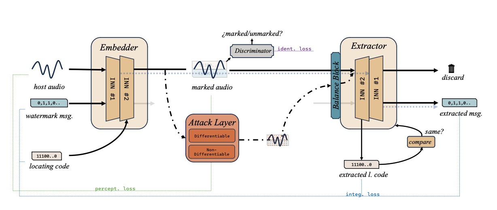
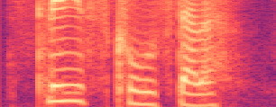

# IDEAW

## Abstract

Audio watermarking embeds messages into the audio and accurately extracts the watermark even after the watermarked audio has been damaged. Compared to traditional digital watermarking algorithms, neural watermarking using neural networks has better robustness against various attacks that are considered during the training process. However, neural watermarking methods suffer to low capacity. In addition, in practical scenarios, watermarks are redundantly embedded in audio according to the demand, and the audio is also subject to cropping and splicing, which makes the efficient locating of watermarks a problem worth exploring. In this paper, we use invertible neural network to realize a dual-embedding strategy, and at the same time, we consider the impact of the attack layer on the invertible neural network in robustness training and improve the model so as to enhance the reasonableness and stability. Experiment shows that the proposed model, IDEAW, can withstand various attacks and has higher capacity with more efficient locating ability compared to the state-of-the-art methods.

## Overview

The Architecture of IDEAW.

&nbsp;
 

## Watermarked Audio Samples
Audio samples are taken from the VCTK corpus and FMA corpus. The capacity of **IDEAW** achieves 46 bits per second (maintaining SNR at about 30 dB).
### What can 46-bit watermarks accomplish?

##### · Embedding 7*6 binary figures into audios.
 <audio controls id="player" onplay="pauseOthers(this);"><source src="assets/wmd_audios/p227_003.mp3" type="audio/mpeg"></audio> SNR = ??, ACC=??

 <audio controls id="player" onplay="pauseOthers(this);"><source src="assets/wmd_audios/p227_003.mp3" type="audio/mpeg"></audio> SNR = ??, ACC=??

 <audio controls id="player" onplay="pauseOthers(this);"><source src="assets/wmd_audios/p227_003.mp3" type="audio/mpeg"></audio> SNR = ??, ACC=??

 <audio controls id="player" onplay="pauseOthers(this);"><source src="assets/wmd_audios/p227_003.mp3" type="audio/mpeg"></audio> SNR = ??, ACC=??

 <audio controls id="player" onplay="pauseOthers(this);"><source src="assets/wmd_audios/p227_003.mp3" type="audio/mpeg"></audio> SNR = ??, ACC=??

##### · Embedding 5-bit encoded characters into audios. (46 bits watermark -> 9 characters)
Embedding "IDEAWOKAY" (01000-00100-00101-00001-10111-01111-01011-00001-11001-0) into audio.

"IDEAWOKAY" <audio controls id="player" onplay="pauseOthers(this);"><source src="assets/wmd_audios/p227_003.mp3" type="audio/mpeg"></audio> SNR = ??, ACC = ??

&nbsp;
 

## Waveform Samples
Waveforms of watermared audios and residual to host audios. The size of the embedded watermark defaults to 46 bits.

(i) SNR=??

(ii) SNR=??

(iii) SNR=??

(iv) SNR=??

# IDEAW Code
We will release our code as soon as the paper is accepted.
